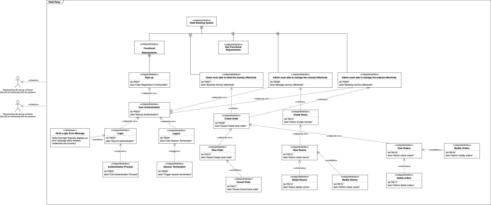

# Hotel Booking System

[](https://nodejs.org/)
[](https://expressjs.com/)
[](https://www.mongodb.com/)
[](https://reactjs.org/)
[](https://tailwindcss.com/)
[](https://reactrouter.com/)

## Author
- Huixue Han

## Project Description
A modern hotel booking system that enables users to seamlessly book and manage hotel room reservations.

## Tech Stack

### Backend
- 🚀 Node.js - JavaScript runtime
- 🛠️ Express - Web framework
- 📦 MongoDB - Database

### Frontend
- ⚛️ React.js - UI library
- 🎨 TailwindCSS - Styling
- 🔄 React Router - Navigation

## Project Management
[](https://ictrun.atlassian.net/jira/software/projects/HBS/summary)

## System Design
### Requirement Diagram


## Getting Started

### Integrated Deployment
```bash
npm run start
```
- Only Backend:
```bash
cd backend
npm run start
```
- Only Frontend:
```bash
cd frontend
npm run start
```

## Origin Requirement:
[Requirements](./requirements.md)
